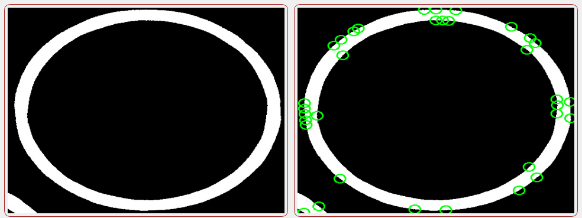

# 项目名称：QVision
## 项目菜单一览
- 菜单栏
    - 文件
        - 打开
        - 保存
    -  预处理
        - 基本变换
        - 降噪处理
        - 形态学处理
    -  工具
        - 边缘检测
        - 阈值处理
        - 提取轮廓
        - 图像金字塔
        - 屏幕截图
        - 区域覆盖
        - ...
    -  运算
        - 开运算
        - 闭运算
        - 拉普拉斯变换
        - 傅里叶变换
        - 线性拉伸
        - ...
    -  算法
        - 广义霍夫
        - 角点检测
        - 漫水填充
        - 模板匹配
        - 透视变换
        - ...
    -  批处理
        - 批量导出
        - 批量重命名
        - 批量写入文件信息
        - 批量导出图像数据
    -  模型
        - 自定义模型
        - 人脸识别模型
        - 字符识别模型
        - 摄像头动态跟踪
        - ...
    -  网络
        - 网络爬虫
        - 虚拟客户端服务器
        - ...
    -  媒体
        - 视频播放器
        - ...
    - 数据库
        - SQLite
        - MySQL
        - Sql Server
        - ...
    -  关于
        - github
        - csdn
        - juejin
## 文件目录

``` txt
──┬───┬─ QVision - 项目
  │   ├───┬─ data--模型文件   
  │   ├───┬─ version x.x 版本文件(含可执行文件)
  |————README.md - 项目说明文档
```
# 项目功能
### 双边滤波

 ### 直方图

 ### 区域填充

 ### 旋转缩放

 ### 图像均衡化

 ### 猫脸检测

 ### 人脸检测
 
 ### 检测圆

 ### 霍夫变换

 ### 检测三角形

 ### 角点检测
 
 ### 拉普拉斯变换

 ### 字符识别

 ### 提取轮廓

### 边缘检测

### 边缘检测

### 角点检测

### 模板匹配

### 关键点匹配

### 截取区域

### 摄像头捕捉圆形

### 屏幕截图

### 数据库

### 查找数据

### 网络爬虫

### 模拟客户端/服务器

### 执行系统指令

### 查看系统信息

### 视频播放器

## 更多功能

### 模拟贝塞尔曲线
### 远程登录
### 升级模板匹配
### 仿射变换
### 漫水填充
### 区域生长
### 区域覆盖
### 透视变换
### AI换脸
### 接入ChatGPT
### IP地址查询
### 号码归属地查询
### VR
### AR
### ...